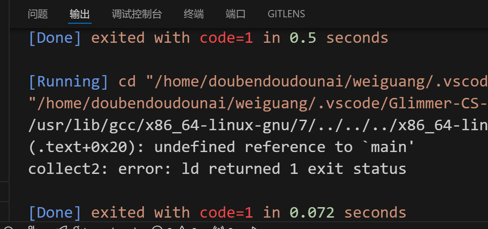
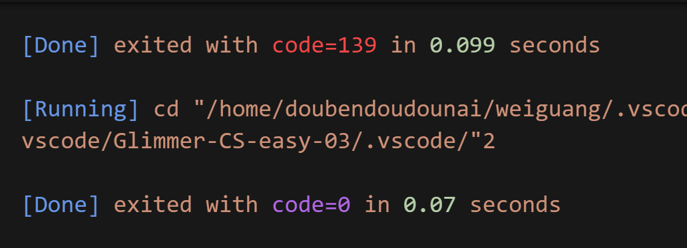

# C语言内存模型  
### 栈区   
* 具体含义：由编译器自动分配释放，有操作系统自动管理，主要存放局部变量、形参、返回值。   
栈区上的内存分配是连续的。      
栈区按内存地址由高到低方向生长。   
栈区遵循先进后出原则。   
* 应用场景：可用于存储局部变量和函数调用的相关信息。   
* 调用方式：无须手动管理。   
### 堆区  
* 具体含义：由程序员分配内存和释放，按内存地址由低到高方向生长，速度较慢，但自由性大。  
* 应用场景：在链表中用`malloc`函数实现动态分布内存。   
* 调用方式：`malloc`函数，`new`函数等。      
### 全局数据区
* 具体含义：指用于存储全局变量和静态变量的内存区域。   
分为.bss段（存放未初始化或初始化为0的全局变量和静态变量）和.data段（已初始化的全局变量和静态变量）。   
* 应用场景：初始化；程序中的一些配置参数可定义为全局变量；全局变量可以在多个函数之间共享数据。   
* 调用方式：直接引用变量名使用全局变量，用`extern`关键字声明静态变量后才能使用。   
### 常量区   
* 具体含义：用来存放字符串，数字等常量的内存区域，`const`修饰的全局变量存放在常量区。程序运行期间，常量区内容不可修改。      
* 应用场景：字符串管理；避免意外修改等。   
* 调用方式:通常通过`const`关键字定义。   
### 代码区   
* 具体含义：存放程序执行代码的内存区域，其值不能修改；代码区包含程序的所有逻辑。这包括函数定义、控制流语句等，在程序启动时载入内存中并由CPU按顺序执行。    
* 应用场景：编写代码。      
### 动态链接库   
* 具体含义：动态库是在运行时加载到内存的共享库段，可大大节省内存。   
* 应用场景：代码重用，多个应用程序可以共享同一份库，避免重复编码和维护相同的功能等。   
* 调用方式：创建动态链接库，`.dll`在Windows上的动态链接库文件；链接库和使用库。   
# 导学问题
1. 栈溢出：栈溢出指的是程序向栈中某个变量中写入的字节数超过了这个变量本身所申请的字节数，因而导致与其相邻的栈中的变量的值被改变。  
2. (1) 大小差异：栈的最大容量是预先规定好的，一般较小；堆的大小偏大一些，会手动进行分配。  
   (2) 效率差异：栈区由系统自动分配，速度较快；堆是由`malloc`函数分配的内存，一般速度较慢。  
   (3) 申请方式：堆区由系统自动分配；栈区需要程序员自己申请，并指明大小。  
3. 只读：代码区，常量区；可读写：数据区，堆区，栈区，全局数据区
4. 使用头文件`stdlib.h`   
   `void *malloc(long NumBytes)`：该函数分配了NumBytes个字节，并返回了指向这块内存的指针。如果分配失败，则返回一个空指针（NULL）。   
   `void free(void *FirstByte)`： 该函数是将之前用malloc分配的空间还给程序或者是操作系统，也就是释放了这块内存，让它重新得到自由   
   `malloc()`函数和`free()`函数是配套使用的，一定要记得释放，否则就是内存泄漏。用完之后要让指针指向NULL。       
   例如`Ptr = (char *)malloc(100 * sizeof(char))``free(Ptr)`
   `malloc()`是从堆中获得空间，`free()`释放的是堆上的内存。   
5. 对程序使用的内存进行管理是为了确保系统中的所有程序都能够访问所需的内存，并且不会发生内存冲突或内存泄漏等问题，防止内存资源浪费或程序崩溃。    
# 内存模型的应用   
`constValue`：常量区,用`printf`输出该变量的地址为0x555555400814，是16进制的整型，在整个代码中不变；且用`const`定义的变量是常量，因此存储在常量区。    
`constString`:常量区，变量地址为0x555555601018，是16进制的整型,所以也存储在常量区。   
`globalVar`：全局数据区，是全局变量，如果这个变量不是全局变量，那应该在`main`函数内声明,而全局变量储存在全局数据区，因此可推出该变量在全局数据区。输出其地址为0x555555601010。   
`staticVar`：全局数据区,这个变量在`main`函数内用`static`声明，说明他是静态变量，静态变量存储在全局数据区。如果他和`globalvar`在同一区域，他们的地址应相差无几，输出其地址为0x555555601010，和`globalvar`的地址很像，说明它就在全局数据区。    
`localVar`：栈区，在函数内部，且用`int`声明，说明他是局部变量，局部变量应该存储在栈区。如果不是局部变量，那应该在函数外部声明。他的地址是0x7fffffffdf5c。    
`ptr`： 堆区。用`malloc`申请内存，并用`free`释放内存，说明在堆区。   
`localVarMain`：栈区。这个变量的输出地址是0x7fffffffdf84，和`localvar`是同一类型，他们应该在同一区域，所以它也在栈区。  
# 浅谈Cache 
 ### 冯诺依曼体系结构     
 1. 计算机由五大部件组成     
   * 运算器（顾名思义，做计算，但通过上网查询了解到并不是我理解的简单的加减乘除，还包括逻辑运算，即与·或·非的计算）；    
   * 存储器 （用来存储程序和数据的）；   
   * 控制器（控制程序的运行，通过控制线与各个部件通信）；   
   * 输入设备（用来输入信息，比如键盘，麦克风）；   
   * 输出设备（输出信息的，比如打印机，投影仪）。  
2. 指令和数据以同等地位存于存储器，可按地址寻访。   
3. 指令和数据都以二进制表示。   
4. 指令由操作码和地址码组成，操作码用来表示操作的性质 ，地址码用来表示操作数在存储器中的位置。   
5. 指令在存储器内按顺序存放，且通常指令顺序执行。   
6. 以运算器为中心。（以运算器为中心可能会导致运算器承担更多的工作）。    
### 现代计算机组织结构 
1. CPU：把运算器和存储器放到一起，成为中央处理器（CPU），CPU是计算机最宝贵的资源，相当于计算机的大脑。   
   存储器：分为内存储器和外存储器；   
   输出设备，输入设备。   
2. 现代计算机以存储器为中心。   
### 区别
1. 现代计算机把数据先存放到存储器在跟CPU做交互，而冯诺依曼结构直接通过运算器做运算。   
2. 现代计算机以存储器为中心，冯诺依曼体系结构以运算器为中心。   
3. 冯诺依曼体系结构的指令只能逐条进行，限制了并行运算能力，现代计算机则可以实现并行处理。   
### 心得
我们通过前人的智慧不断改进，科技才得以不断进步，冯诺依曼结构的系统处理速度不高，但现代计算机结构引入了缓存来缓解它的缺点，并且通过以存储器为中心，让CPU做一些重要的任务，减少了运算器的压力，这些都是经过一代代人的不断探索与改进的结果。
### 主存储器的工作原理
* 主存储器包括RAM（随机存取存储器）和ROM（只读存储器），RAM分为SRAM和DRAM。
* 主存储器的内部结构有存储体（存储体由许多存储单元组成，每个存储单元又包含若干个存储元件。一个存储单元存储一连串的二进制代码，而存储元件则可以存储一位二进制数0或1），MAR（存储地址寄存器），MDR（存储数据寄存器）。   
* 当要完成一个完整的读取操作时，首先 CPU 中的控制器发出读命令等控制信号，通过地址总线将存储单元的地址从 MAR 传输到主存储器。主存储器根据地址找到相应的存储单元，将存储单元中的数据通过数据总线传输到 MDR，再由 MDR 传输到 CPU 内部进行处理；在写入操作时，CPU 将数据加载到 MDR中，然后发出写入数据的指令，将MDR中的数据写入到MAR指示的内存位置。   
### Cache的局部性原理
* 局部性原理是指对局部范围的存储器地址频繁访问，而对其他范围的访问甚少。而Cache的局部性原理就是指将常用的数据和指令从主存调入Cache，供CPU在一段时间内使用，从而提高访问速度。
* 时间局部性：在未来要用到的信息，很可能是现在正在使用的信息（我的理解是，相当于重复利用，比如循环中的一些信息就会重复使用，那么它应该具有时间局部性）   
* 空间局部性：在最近的未来要用到的信息（指令和数据），很可能与现在正在使用的信息在存储空间上是邻近的（应该就是要按顺序执行指令吧）。   
* CPU主频提升会带动系统性能的改善，但内存存取速度较低会导致CPU等待，降低处理速度，浪费CPU能力，因此在慢速的DRAM和快速的CPU之间插入一至多级的速度较快、容量较小的SRAM起到缓冲作用，使CPU能够快速存取主存中的数据，而不使系统成本上升过高，而这个SRAM就是Cache。   
### 代码优化
```
#define M 128
#define N 64
int sum(int a[M][N]) {
  int i, j, sum = 0;
  for (j = 0; j < N; ++j) {
    for (i = 0; i < M; ++i) {
      sum += a[i][j];
    }
  }
  return sum;
}
```
上面的代码中的循环先循环变量i，在循环变量j，是按列优先循环的，而C语言中的数组元素是按照行优先存储的，这就使得访问并未集中在相邻位置，跨度较大，即空间局限性差，将代码优化如下：   
```
#define M 128
#define N 64
int sum(int a[M][N]) {
  int i, j, sum = 0;
  for (i = 0; i < N; ++i) {
    for (j = 0; j < M; ++j) {
      sum += a[i][j];
    }
  }
  return sum;
}
```
运行结果如下：

可以看到，优化后的代码运行时间明显减少。   


```
#include <stdio.h>

void Function() {
    Function(); 
}

int main() {
    Function();
    return 0;
}
```
上面的代码无限递归，导致栈溢出，优化后的代码如下：
```
#include <stdio.h>

void Function(int depth) {
    if (depth == 0) return;
    Function(depth - 1);
}

int main() {
    Function(10); // 有限递归，避免栈溢出
    return 0;
}
```
优化后可避免栈溢出，结果如下：

  

另外，分配过大的局部变量、嵌套函数调用过多也可能会导致栈溢出，他们的解决方法是使用动态内存分配，减少不必要的嵌套。